# Lưu đồ Phân loại Sự cố Hệ thống

```mermaid
flowchart TD
    %% Điểm bắt đầu
    USER["👤 Người dùng<br/>báo cáo sự cố"]
    
    %% Tiếp nhận sự cố
    RECEIVE["📥 Tiếp nhận sự cố<br/>& Phân tích ban đầu"]
    
    %% Các nhóm lỗi chính
    SYSTEM["🖥️ LỖI HỆ THỐNG<br/><small>System Issues</small>"]
    TRADING["💹 LỖI LOGIC GIAO DỊCH<br/><small>Trading Logic</small>"]
    CHART["📊 LỖI CHART & MARKET DATA<br/><small>Chart & Market Data</small>"]
    UI["🎨 LỖI UI/UX - HIỂN THỊ<br/><small>UI/UX Display</small>"]
    PAYMENT["💳 LỖI THANH TOÁN<br/><small>Payment Issues</small>"]
    PROMO["🎁 LỖI PROMOTION/EVENT<br/><small>Promotion/Event</small>"]
    
    %% Lỗi hệ thống chi tiết
    SYS1["🔴 CRITICAL<br/>Toàn bộ hệ thống ngừng<br/><small>Complete system down</small>"]
    SYS2["🔴 CRITICAL<br/>Tấn công DDoS<br/><small>DDoS attack</small>"]
    SYS3["🔴 CRITICAL<br/>Cơ sở dữ liệu hỏng<br/><small>Database corruption</small>"]
    SYS4["🔴 CRITICAL<br/>Ví nóng bị hack<br/><small>Hot wallet compromised</small>"]
    SYS5["🟠 HIGH<br/>Tài khoản bị xâm nhập<br/><small>Account breach</small>"]
    SYS6["🔵 MEDIUM<br/>Lỗi hệ thống KYC<br/><small>KYC system error</small>"]
    
    %% Lỗi logic giao dịch
    TRD1["🟠 HIGH<br/>Trượt giá bất thường<br/><small>Abnormal slippage</small>"]
    TRD2["🟠 HIGH<br/>Mất thanh khoản<br/><small>Liquidity shortage</small>"]
    TRD3["🟠 HIGH<br/>Cháy lệnh bất thường<br/><small>Abnormal order execution</small>"]
    TRD4["🟠 HIGH<br/>Margin call sai<br/><small>Incorrect margin call</small>"]
    
    %% Lỗi chart & market data
    CHT1["🟠 HIGH<br/>Lỗi hiển thị nến<br/><small>Candlestick display error</small>"]
    CHT2["🔵 MEDIUM<br/>Nến chậm so với sàn khác<br/><small>Delayed candles vs other exchanges</small>"]
    
    %% Lỗi UI/UX
    UI1["🟠 HIGH<br/>Sai số dư hiển thị<br/><small>Incorrect balance display</small>"]
    UI2["🔵 MEDIUM<br/>Lệnh bị ẩn<br/><small>Orders not visible</small>"]
    
    %% Lỗi thanh toán
    PAY1["🟠 HIGH<br/>Nạp/rút bị treo<br/><small>Deposit/withdrawal stuck</small>"]
    
    %% Lỗi promotion
    PROM1["🟢 LOW<br/>User không nhận được ưu đãi<br/><small>User didn't receive promotion</small>"]
    
    %% Kết nối
    USER --> RECEIVE
    
    RECEIVE --> SYSTEM
    RECEIVE --> TRADING
    RECEIVE --> CHART
    RECEIVE --> UI
    RECEIVE --> PAYMENT
    RECEIVE --> PROMO
    
    %% Kết nối lỗi hệ thống
    SYSTEM --> SYS1
    SYSTEM --> SYS2
    SYSTEM --> SYS3
    SYSTEM --> SYS4
    SYSTEM --> SYS5
    SYSTEM --> SYS6
    
    %% Kết nối lỗi giao dịch
    TRADING --> TRD1
    TRADING --> TRD2
    TRADING --> TRD3
    TRADING --> TRD4
    
    %% Kết nối lỗi chart
    CHART --> CHT1
    CHART --> CHT2
    
    %% Kết nối lỗi UI
    UI --> UI1
    UI --> UI2
    
    %% Kết nối lỗi thanh toán
    PAYMENT --> PAY1
    
    %% Kết nối lỗi promotion
    PROMO --> PROM1
    
    %% Styling với màu sắc đẹp và hiện đại
    classDef userStyle fill:#e3f2fd,stroke:#1976d2,stroke-width:3px,color:#000
    classDef receiveStyle fill:#f3e5f5,stroke:#7b1fa2,stroke-width:3px,color:#000
    
    classDef systemStyle fill:#ffebee,stroke:#d32f2f,stroke-width:2px,color:#000
    classDef tradingStyle fill:#fff8e1,stroke:#f57c00,stroke-width:2px,color:#000
    classDef chartStyle fill:#f1f8e9,stroke:#388e3c,stroke-width:2px,color:#000
    classDef uiStyle fill:#e0f2f1,stroke:#00796b,stroke-width:2px,color:#000
    classDef paymentStyle fill:#fce4ec,stroke:#c2185b,stroke-width:2px,color:#000
    classDef promoStyle fill:#e8f5e8,stroke:#4caf50,stroke-width:2px,color:#000
    
    classDef criticalError fill:#ffcdd2,stroke:#b71c1c,stroke-width:2px,color:#000,stroke-dasharray: 5 5
    classDef highError fill:#ffe0b2,stroke:#e65100,stroke-width:2px,color:#000
    classDef mediumError fill:#c8e6c9,stroke:#2e7d32,stroke-width:2px,color:#000
    classDef lowError fill:#dcedc8,stroke:#558b2f,stroke-width:2px,color:#000
    
    %% Áp dụng styling
    class USER userStyle
    class RECEIVE receiveStyle
    
    class SYSTEM systemStyle
    class TRADING tradingStyle
    class CHART chartStyle
    class UI uiStyle
    class PAYMENT paymentStyle
    class PROMO promoStyle
    
    %% Styling theo mức độ nghiêm trọng
    class SYS1,SYS2,SYS3,SYS4 criticalError
    class SYS5,TRD1,TRD2,TRD3,TRD4,CHT1,UI1,PAY1 highError
    class SYS6,CHT2,UI2 mediumError
    class PROM1 lowError
```

## Mô tả các mức độ nghiêm trọng:

- 🔴 **CRITICAL**: Ảnh hưởng nghiêm trọng đến toàn bộ hệ thống, cần xử lý ngay lập tức
- 🟠 **HIGH**: Ảnh hưởng đến chức năng chính, cần xử lý trong vòng 1-2 giờ
- 🔵 **MEDIUM**: Ảnh hưởng một phần chức năng, xử lý trong vòng 4-8 giờ
- 🟢 **LOW**: Ảnh hưởng nhỏ, có thể xử lý trong ngày

## Hướng dẫn sử dụng:

1. **Tiếp nhận sự cố**: Tất cả sự cố từ người dùng đều được phân tích ban đầu
2. **Phân loại**: Xác định nhóm lỗi chính (6 nhóm)
3. **Chi tiết hóa**: Xác định lỗi cụ thể và mức độ nghiêm trọng
4. **Ưu tiên xử lý**: Dựa trên màu sắc và mức độ nghiêm trọng để ưu tiên

## Quy trình escalation:

- **🔴 Critical**: Báo cáo ngay cho C-level
- **🟠 High**: Báo cáo cho Team Lead trong 30 phút
- **🔵 Medium**: Báo cáo theo quy trình thường
- **🟢 Low**: Xử lý theo kế hoạch bình thường